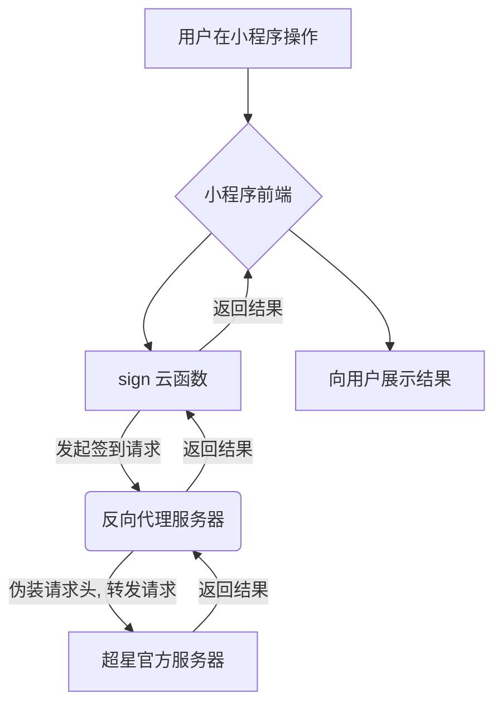

# 超星学习通助手小程序

[](https://opensource.org/licenses/MIT)

一款专为"超星学习通"平台打造的微信小程序，旨在提供一个更加便捷、自动化的课程管理和签到体验。
一人点击多人签到，可以睡个懒觉了
针对冷启动做了优化，免费云开发环境支持最多8人

✨ 主要功能

- 多账户管理：轻松添加、切换和管理多个学习通账号。
- 课程同步：自动获取并展示您账户下的所有课程列表。
- 活动检测：实时扫描所有课程，自动发现进行中的签到、考试等活动。
- 一键签到：核心功能，一键完成所有检测到的签到任务，省时省力。
- 多种签到方式支：
  - ✔️ 普通签到
  - ✔️ 手势签到
  - ✔️ 位置签到 (需提供坐标)
  - ✔️ 二维码/签到码签到

 🚀 技术架构

本项目采用前后端分离的云开发模式，确保了系统的灵活性与可扩展性。

- 前端：微信小程序原生框架 (WXML, WXSS, JavaScript)
- 后端：微信小程序云开发 - 云函数 (Node.js)
- 数据库：微信小程序云开发 - 云数据库
- 核心网络：通过反向代理突破 API 限制，是整个系统能够工作的关键。

工作流程图

为了绕过官方接口的跨域和安全限制，所有与签到相关的请求都会通过一个反向代理服务器进行中转。



🛠️ 如何部署 (Deployment)

您可以轻松地将此项目部署到您自己的微信小程序账号上。

 准备工作

1.  安装 [微信开发者工具](https://developers.weixin.qq.com/miniprogram/dev/devtools/download.html)。
2.  拥有一个自己的微信小程序账号，并开通云开发服务。

 部署步骤

第一步：获取代码

```bash
git clone [您的项目仓库地址]
```

第二步：导入并配置小程序**

1.  打开微信开发者工具，点击"导入"，选择项目根目录。
2.  填入您自己的 **AppID**。
3.  项目会自动识别 `project.config.json` 并完成基本配置。

第三步：部署云函数

1.  在开发者工具中，找到 `cloudfunctions` 目录。
2.  右键点击 `cloudfunctions` 目录，选择"创建并部署：所有云函数"。
    - 如果此选项不可用，请逐个右键点击每个云函数目录（如 `sign`, `loginUser` 等），选择"上传并部署：云端安装依赖"。
3.  等待所有云函数部署成功。

第四步：配置反向代理 (最关键的一步！)

本项目需要一个反向代理服务器来中转请求。这里推荐使用免费且简单的 Cloudflare Workers。
你需要有一个自己的域名，建议直接在腾讯云和阿里云购买很便宜

1.  创建 Worker:
    *   登录 [Cloudflare](https://dash.cloudflare.com/)。
    *   在左侧菜单中找到 `Workers & Pages` -> `创建应用程序` -> `创建 Worker`。
    *   给你的 Worker 起一个名字，然后点击 `部署`。
    *   部署后，点击 `编辑代码`。

2.  粘贴代理代码:
    *   删除编辑器中的所有默认代码。
    *   将项目中的 `反代代码.js` 文件里的所有代码复制并粘贴进去。
    *   点击 `部署`。

3.  获取 Worker 地址:
    *   部署成功后，您会得到一个类似 `your-worker-name.your-subdomain.workers.dev` 的地址，复制它。

4.  修改云函数配置:
    *   回到微信开发者工具，打开 `cloudfunctions/sign/index.js` 文件。
    *   在文件中搜索 `luwang555.chat` 这个地址。
    *   将所有找到的 `https://luwang555.chat` 替换为您刚刚复制的 Worker 地址。
    *   修改完成后，重新部署 `sign` 云函数。

至此，整个项目已完全部署在您的环境中！您可以在小程序中开始使用了。


 ⚠️ 免责声明

- 本项目仅供学习和技术研究使用，严禁用于任何商业或非法用途。
- 使用本项目所造成的一切后果，包括但不限于账号被限制、数据泄露等，均由使用者本人承担。
- 项目作者不对任何潜在的风险或问题负责。如果您选择使用本项目，即代表您同意此免责声明。

 📄 开源许可

本项目采用 [MIT License](https://opensource.org/licenses/MIT) 开源许可。 
